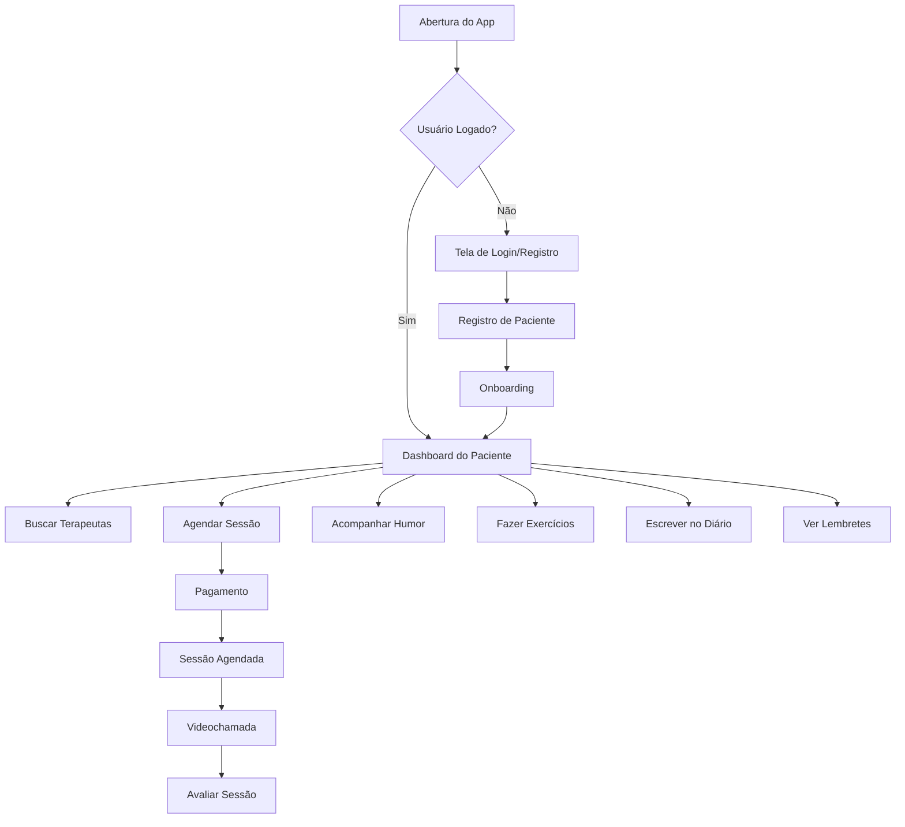
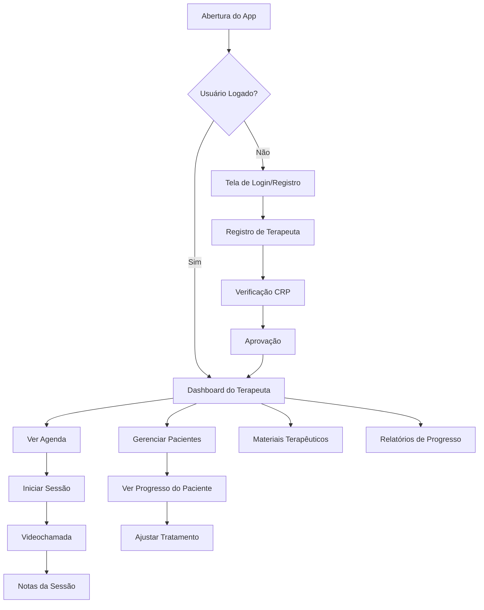

# Safe in Save - Especificação Técnica e Arquitetural

## 1. Visão Geral do Projeto

**Nome:** Safe in Save  
**Tipo:** Aplicativo mobile de terapia  
**Tecnologias:** TypeScript, Expo, React Native  
**Backend:** Node.js/Express + PostgreSQL  

### 1.1 Objetivo
Desenvolver um aplicativo mobile nativo para terapia que forneça uma plataforma segura e eficaz para sessões terapêuticas, acompanhamento de progresso e comunicação entre terapeutas e pacientes, com funcionalidades avançadas de bem-estar mental.

### 1.2 Requisitos Funcionais (Baseados no CuraConnect)

#### Funcionalidades Básicas Herdadas:
- **Autenticação e Perfis:** Sistema de login/registro para terapeutas e pacientes
- **Busca de Terapeutas:** Listagem, filtros e perfis detalhados
- **Agendamento:** Sistema de marcação de consultas com disponibilidade
- **Videochamadas:** Sessões terapêuticas online integradas
- **Pagamentos:** Integração com Stripe para processamento
- **Avaliações:** Sistema de reviews e ratings
- **Materiais Terapêuticos:** Compartilhamento de recursos
- **Timeline:** Feed de conteúdo educativo

#### Funcionalidades Avançadas (Novas):
- **Acompanhamento de Humor:** Registro diário de estado emocional
- **Exercícios Terapêuticos:** Biblioteca de atividades guiadas
- **Diário Pessoal:** Espaço privado para reflexões
- **Sistema de Lembretes:** Notificações para sessões, exercícios e medicamentos
- **Análise de Progresso:** Dashboards com métricas de bem-estar
- **Chat Seguro:** Comunicação criptografada entre sessões

## 2. Arquitetura Geral

### 2.1 Arquitetura de Alto Nível

```
┌─────────────────────────────────────┐
│           MOBILE APP                │
│      (Expo + React Native)          │
├─────────────────────────────────────┤
│         API Gateway                 │
│      (Express.js Router)            │
├─────────────────────────────────────┤
│       Business Logic Layer          │
│     (Services + Controllers)        │
├─────────────────────────────────────┤
│        Data Access Layer            │
│      (Drizzle ORM + Storage)        │
├─────────────────────────────────────┤
│         Database Layer              │
│         (PostgreSQL)                │
└─────────────────────────────────────┘
```

### 2.2 Padrões Arquiteturais
- **Clean Architecture:** Separação clara entre camadas
- **Repository Pattern:** Abstração do acesso a dados
- **Service Layer:** Lógica de negócio centralizada
- **Component-Based:** Interface modular e reutilizável

## 3. Estrutura de Pastas

```
safe-in-save/
├── app/                          # Expo Router (App Directory)
│   ├── (auth)/                   # Grupo de rotas de autenticação
│   │   ├── login.tsx
│   │   ├── register.tsx
│   │   └── _layout.tsx
│   ├── (patient)/                # Rotas do paciente
│   │   ├── dashboard.tsx
│   │   ├── therapists/
│   │   ├── appointments/
│   │   ├── mood-tracker/
│   │   ├── exercises/
│   │   ├── diary/
│   │   └── _layout.tsx
│   ├── (therapist)/              # Rotas do terapeuta
│   │   ├── dashboard.tsx
│   │   ├── patients/
│   │   ├── schedule/
│   │   ├── materials/
│   │   └── _layout.tsx
│   ├── (shared)/                 # Rotas compartilhadas
│   │   ├── video-session/
│   │   ├── chat/
│   │   └── profile/
│   ├── _layout.tsx               # Layout raiz
│   └── index.tsx                 # Tela inicial
├── src/
│   ├── components/               # Componentes reutilizáveis
│   │   ├── ui/                   # Componentes base (Button, Input, etc.)
│   │   ├── forms/                # Formulários específicos
│   │   ├── charts/               # Gráficos e visualizações
│   │   ├── therapy/              # Componentes específicos de terapia
│   │   └── navigation/           # Componentes de navegação
│   ├── hooks/                    # Custom hooks
│   │   ├── useAuth.ts
│   │   ├── useApi.ts
│   │   ├── useMoodTracker.ts
│   │   ├── useNotifications.ts
│   │   └── useStorage.ts
│   ├── services/                 # Serviços e APIs
│   │   ├── api/                  # Chamadas para API
│   │   ├── auth/                 # Autenticação
│   │   ├── storage/              # Armazenamento local
│   │   ├── notifications/        # Push notifications
│   │   └── encryption/           # Criptografia
│   ├── store/                    # Estado global (Zustand)
│   │   ├── authStore.ts
│   │   ├── userStore.ts
│   │   ├── moodStore.ts
│   │   └── appointmentStore.ts
│   ├── types/                    # Definições de tipos TypeScript
│   │   ├── api.ts
│   │   ├── user.ts
│   │   ├── therapy.ts
│   │   └── mood.ts
│   ├── utils/                    # Utilitários
│   │   ├── constants.ts
│   │   ├── helpers.ts
│   │   ├── validation.ts
│   │   └── formatters.ts
│   └── styles/                   # Estilos globais
│       ├── colors.ts
│       ├── typography.ts
│       └── spacing.ts
├── server/                       # Backend API
│   ├── src/
│   │   ├── controllers/          # Controladores de rota
│   │   ├── services/             # Lógica de negócio
│   │   ├── models/               # Modelos de dados
│   │   ├── middleware/           # Middlewares
│   │   ├── routes/               # Definições de rotas
│   │   ├── utils/                # Utilitários do servidor
│   │   └── config/               # Configurações
│   ├── database/
│   │   ├── migrations/           # Migrações do banco
│   │   ├── seeds/                # Dados iniciais
│   │   └── schema.ts             # Esquema do banco
│   └── tests/                    # Testes do backend
├── shared/                       # Código compartilhado
│   ├── types/                    # Tipos compartilhados
│   ├── schemas/                  # Schemas de validação
│   └── constants/                # Constantes compartilhadas
├── assets/                       # Recursos estáticos
│   ├── images/
│   ├── icons/
│   ├── fonts/
│   └── sounds/
├── docs/                         # Documentação
└── tests/                        # Testes do frontend
```

## 4. Modelos de Dados e Esquema do Banco

### 4.1 Entidades Principais

#### Users (Herdado do CuraConnect)
```typescript
interface User {
  id: string;
  email: string;
  firstName: string;
  lastName: string;
  profileImageUrl?: string;
  userType: 'patient' | 'therapist';
  createdAt: Date;
  updatedAt: Date;
}
```

#### Patients (Estendido)
```typescript
interface Patient {
  id: number;
  userId: string;
  profession?: string;
  preferences?: string;
  anamnesis?: string;
  coverImageUrl?: string;
  // Novos campos
  emergencyContact?: string;
  emergencyPhone?: string;
  medications?: string[];
  allergies?: string[];
  createdAt: Date;
}
```

#### Therapists (Herdado)
```typescript
interface Therapist {
  id: number;
  userId: string;
  crp: string;
  graduationYear: number;
  specializations: string[];
  about?: string;
  sessionPrice: number;
  packagePrice?: number;
  coverImageUrl?: string;
  isVerified: boolean;
  rating: number;
  totalReviews: number;
  createdAt: Date;
}
```

### 4.2 Novas Entidades

#### MoodEntries (Acompanhamento de Humor)
```typescript
interface MoodEntry {
  id: number;
  patientId: number;
  mood: 1 | 2 | 3 | 4 | 5; // 1=muito ruim, 5=excelente
  energy: 1 | 2 | 3 | 4 | 5;
  anxiety: 1 | 2 | 3 | 4 | 5;
  sleep: 1 | 2 | 3 | 4 | 5;
  notes?: string;
  tags?: string[]; // ['estresse', 'trabalho', 'família']
  createdAt: Date;
}
```

#### TherapyExercises (Exercícios Terapêuticos)
```typescript
interface TherapyExercise {
  id: number;
  title: string;
  description: string;
  category: 'breathing' | 'mindfulness' | 'cognitive' | 'behavioral';
  duration: number; // em minutos
  difficulty: 'easy' | 'medium' | 'hard';
  instructions: string[];
  audioUrl?: string;
  videoUrl?: string;
  isActive: boolean;
  createdAt: Date;
}
```

#### ExerciseCompletions (Conclusões de Exercícios)
```typescript
interface ExerciseCompletion {
  id: number;
  patientId: number;
  exerciseId: number;
  completedAt: Date;
  rating?: 1 | 2 | 3 | 4 | 5;
  notes?: string;
  duration: number; // tempo real gasto
}
```

#### DiaryEntries (Diário Pessoal)
```typescript
interface DiaryEntry {
  id: number;
  patientId: number;
  title?: string;
  content: string;
  mood?: 1 | 2 | 3 | 4 | 5;
  isPrivate: boolean; // se o terapeuta pode ver
  tags?: string[];
  createdAt: Date;
  updatedAt: Date;
}
```

#### Reminders (Lembretes)
```typescript
interface Reminder {
  id: number;
  userId: string;
  type: 'appointment' | 'exercise' | 'medication' | 'mood_check' | 'custom';
  title: string;
  description?: string;
  scheduledFor: Date;
  isRecurring: boolean;
  recurringPattern?: 'daily' | 'weekly' | 'monthly';
  isCompleted: boolean;
  completedAt?: Date;
  createdAt: Date;
}
```

#### ChatMessages (Chat Seguro)
```typescript
interface ChatMessage {
  id: number;
  conversationId: number;
  senderId: string;
  receiverId: string;
  content: string; // criptografado
  messageType: 'text' | 'image' | 'file' | 'voice';
  isRead: boolean;
  readAt?: Date;
  createdAt: Date;
}
```

#### Conversations (Conversas)
```typescript
interface Conversation {
  id: number;
  patientId: number;
  therapistId: number;
  lastMessageAt: Date;
  isActive: boolean;
  createdAt: Date;
}
```

## 5. Funcionalidades Detalhadas

### 5.1 Funcionalidades Básicas

#### Autenticação e Perfis
- Login/registro com email e senha
- Autenticação biométrica (Face ID/Touch ID)
- Perfis diferenciados para paciente e terapeuta
- Recuperação de senha
- Verificação de email

#### Busca e Agendamento
- Lista de terapeutas com filtros (especialização, preço, avaliação)
- Perfil detalhado do terapeuta
- Calendário de disponibilidade
- Agendamento de sessões
- Cancelamento e reagendamento

#### Videochamadas
- Integração com WebRTC para chamadas
- Gravação de sessões (com consentimento)
- Chat durante a chamada
- Compartilhamento de tela
- Qualidade adaptativa

### 5.2 Funcionalidades Avançadas

#### Acompanhamento de Humor
- Registro diário de humor, energia, ansiedade e sono
- Gráficos de tendências
- Correlações com eventos
- Alertas para padrões preocupantes
- Compartilhamento com terapeuta

#### Exercícios Terapêuticos
- Biblioteca categorizada de exercícios
- Exercícios de respiração com áudio guiado
- Meditações mindfulness
- Técnicas cognitivo-comportamentais
- Progresso e estatísticas

#### Diário Pessoal
- Entradas livres de texto
- Prompts terapêuticos
- Análise de sentimentos
- Busca por palavras-chave
- Privacidade configurável

#### Sistema de Lembretes
- Lembretes de sessões
- Lembretes de exercícios
- Lembretes de medicação
- Check-ins de humor
- Notificações push personalizadas

## 6. Fluxos de Usuário

### 6.1 Fluxo do Paciente



### 6.2 Fluxo do Terapeuta



## 7. Arquitetura de Segurança e Privacidade

### 7.1 Segurança de Dados
- **Criptografia End-to-End:** Para mensagens e dados sensíveis
- **HTTPS/TLS:** Para todas as comunicações
- **Autenticação JWT:** Com refresh tokens
- **Biometria:** Para acesso rápido e seguro
- **Backup Criptografado:** Dados locais protegidos

### 7.2 Conformidade LGPD
- **Consentimento Explícito:** Para coleta e uso de dados
- **Direito ao Esquecimento:** Exclusão completa de dados
- **Portabilidade:** Exportação de dados pessoais
- **Transparência:** Política de privacidade clara
- **Minimização:** Coleta apenas de dados necessários

### 7.3 Medidas de Segurança
- **Rate Limiting:** Prevenção de ataques
- **Validação de Entrada:** Sanitização de dados
- **Logs de Auditoria:** Rastreamento de ações
- **Sessões Seguras:** Timeout automático
- **Verificação de Integridade:** Detecção de alterações

## 8. Dependências e Bibliotecas

### 8.1 Frontend (Expo/React Native)

#### Core
- `expo` - Framework principal
- `react-native` - Base do React Native
- `typescript` - Tipagem estática
- `@expo/vector-icons` - Ícones

#### Navegação
- `expo-router` - Roteamento baseado em arquivos
- `@react-navigation/native` - Navegação nativa

#### Estado e Dados
- `zustand` - Gerenciamento de estado
- `@tanstack/react-query` - Cache e sincronização de dados
- `axios` - Cliente HTTP

#### UI e Estilo
- `react-native-reanimated` - Animações
- `react-native-gesture-handler` - Gestos
- `react-native-safe-area-context` - Área segura
- `expo-linear-gradient` - Gradientes
- `react-native-svg` - Gráficos vetoriais

#### Funcionalidades Específicas
- `expo-av` - Áudio e vídeo
- `expo-camera` - Câmera
- `expo-notifications` - Notificações push
- `expo-local-authentication` - Biometria
- `expo-secure-store` - Armazenamento seguro
- `expo-crypto` - Criptografia
- `react-native-webrtc` - Videochamadas
- `victory-native` - Gráficos e charts
- `react-native-calendars` - Calendário
- `expo-file-system` - Sistema de arquivos

#### Validação e Formulários
- `react-hook-form` - Formulários
- `zod` - Validação de schemas
- `@hookform/resolvers` - Resolvers para validação

### 8.2 Backend (Node.js/Express)

#### Core
- `express` - Framework web
- `typescript` - Tipagem estática
- `tsx` - Execução TypeScript
- `cors` - CORS middleware
- `helmet` - Segurança HTTP

#### Banco de Dados
- `pg` - Cliente PostgreSQL
- `drizzle-orm` - ORM
- `drizzle-kit` - Migrações

#### Autenticação e Segurança
- `jsonwebtoken` - JWT tokens
- `bcryptjs` - Hash de senhas
- `express-rate-limit` - Rate limiting
- `express-validator` - Validação de entrada

#### Funcionalidades
- `stripe` - Pagamentos
- `nodemailer` - Envio de emails
- `multer` - Upload de arquivos
- `socket.io` - WebSockets para chat
- `node-cron` - Agendamento de tarefas

#### Validação
- `zod` - Validação de schemas
- `zod-validation-error` - Tratamento de erros

## 9. Plano de Implementação

### 9.1 Fase 1 - Fundação (4-6 semanas)
**Prioridade: Alta**
- [ ] Configuração do ambiente Expo
- [ ] Estrutura básica de pastas
- [ ] Sistema de autenticação
- [ ] Navegação entre telas
- [ ] Perfis básicos (paciente/terapeuta)
- [ ] API REST básica
- [ ] Banco de dados PostgreSQL

### 9.2 Fase 2 - Funcionalidades Core (6-8 semanas)
**Prioridade: Alta**
- [ ] Busca e listagem de terapeutas
- [ ] Sistema de agendamento
- [ ] Integração de pagamentos
- [ ] Videochamadas básicas
- [ ] Chat em tempo real
- [ ] Sistema de avaliações

### 9.3 Fase 3 - Funcionalidades Avançadas (8-10 semanas)
**Prioridade: Média**
- [ ] Acompanhamento de humor
- [ ] Biblioteca de exercícios terapêuticos
- [ ] Diário pessoal
- [ ] Sistema de lembretes
- [ ] Notificações push
- [ ] Dashboards de progresso

### 9.4 Fase 4 - Polimento e Segurança (4-6 semanas)
**Prioridade: Alta**
- [ ] Criptografia end-to-end
- [ ] Conformidade LGPD
- [ ] Testes automatizados
- [ ] Otimização de performance
- [ ] Acessibilidade
- [ ] Documentação completa

### 9.5 Fase 5 - Deploy e Monitoramento (2-3 semanas)
**Prioridade: Alta**
- [ ] Deploy em produção
- [ ] Monitoramento e logs
- [ ] Analytics
- [ ] Feedback dos usuários
- [ ] Correções e melhorias

## 10. Considerações Técnicas

### 10.1 Performance
- **Lazy Loading:** Carregamento sob demanda
- **Image Optimization:** Compressão e cache de imagens
- **Bundle Splitting:** Divisão do código
- **Offline Support:** Funcionalidades offline
- **Memory Management:** Gerenciamento de memória

### 10.2 Escalabilidade
- **Microserviços:** Separação de responsabilidades
- **Cache Redis:** Cache distribuído
- **CDN:** Distribuição de conteúdo
- **Load Balancing:** Balanceamento de carga
- **Database Sharding:** Particionamento de dados

### 10.3 Monitoramento
- **Error Tracking:** Sentry para erros
- **Analytics:** Mixpanel ou Firebase Analytics
- **Performance:** New Relic ou DataDog
- **Logs:** Estruturados e centralizados
- **Health Checks:** Monitoramento de saúde

## 11. Próximos Passos

1. **Aprovação da Arquitetura:** Revisão e aprovação desta especificação
2. **Setup do Ambiente:** Configuração do projeto Expo e backend
3. **Prototipagem:** Criação de protótipos das telas principais
4. **Desenvolvimento Iterativo:** Implementação por fases
5. **Testes Contínuos:** Testes durante todo o desenvolvimento
6. **Deploy Gradual:** Lançamento em etapas

---

**Documento criado em:** 29/07/2025  
**Versão:** 1.0  
**Status:** Em Revisão