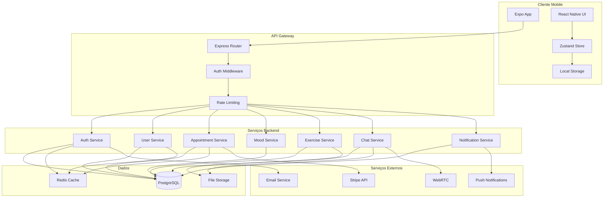
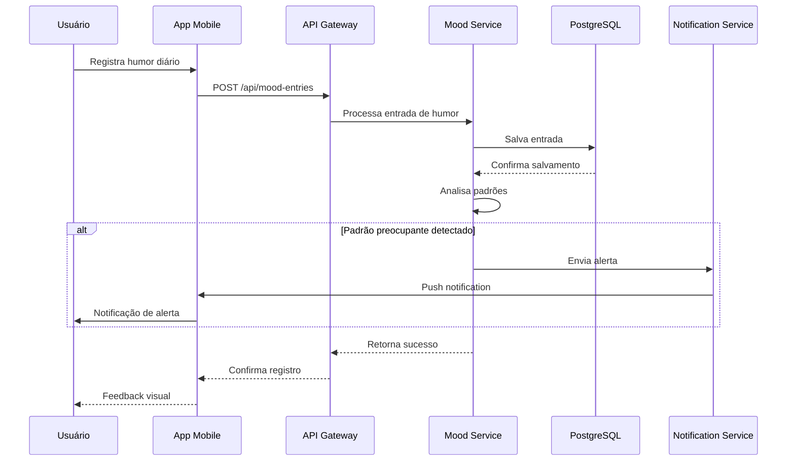
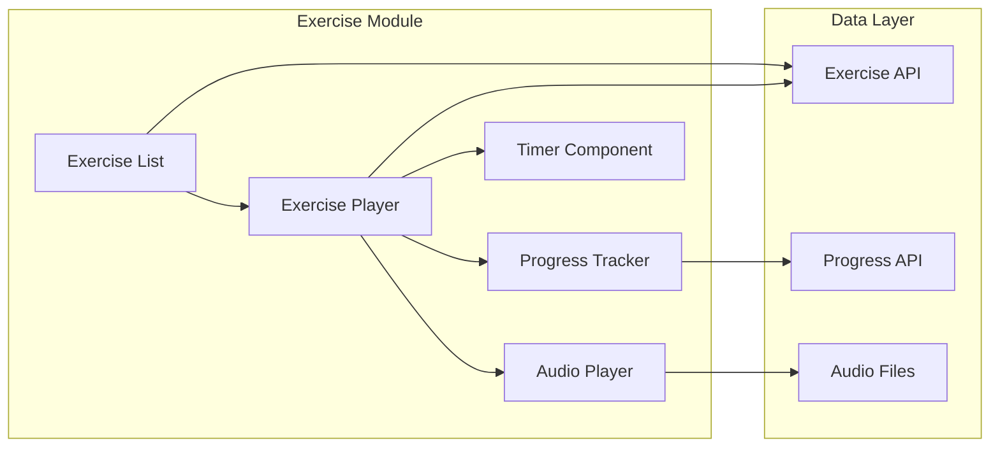
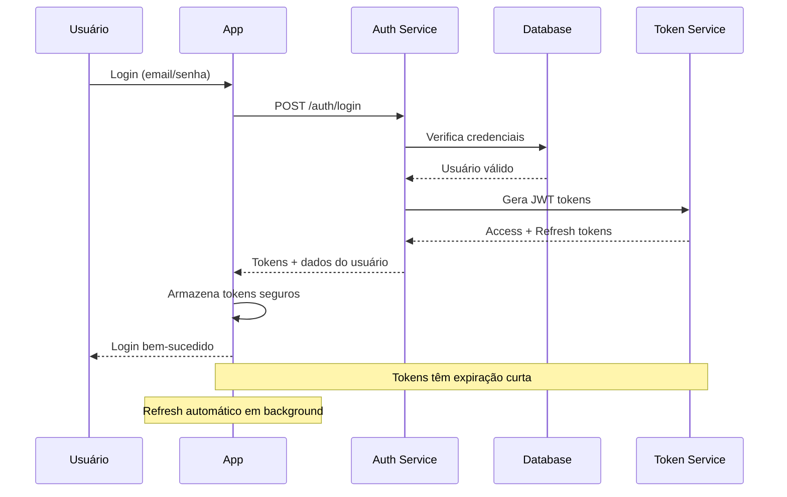
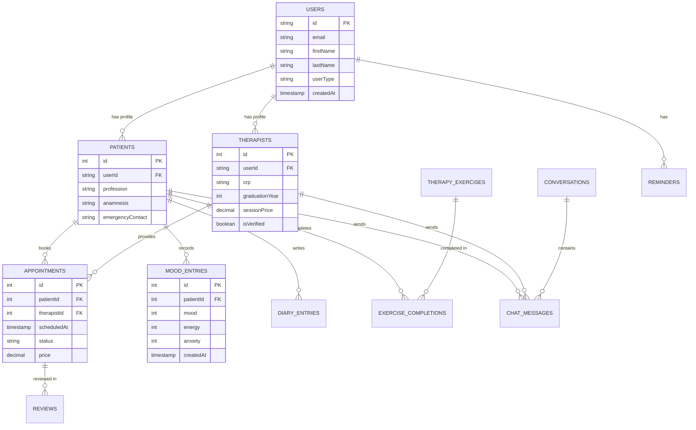

# Safe in Save - Diagramas de Arquitetura

## Diagrama de Arquitetura do Sistema



## Diagrama de Fluxo de Dados - Acompanhamento de Humor



## Diagrama de Componentes - Exercícios Terapêuticos



## Diagrama de Segurança - Fluxo de Autenticação



## Diagrama de Entidades - Relacionamentos do Banco



## Diagrama de Deploy - Infraestrutura

```mermaid
graph TB
    subgraph "Mobile Devices"
        A[iOS App]
        B[Android App]
    end
    
    subgraph "CDN"
        C[Static Assets]
        D[Media Files]
    end
    
    subgraph "Load Balancer"
        E[NGINX]
    end
    
    subgraph "Application Servers"
        F[Node.js Instance 1]
        G[Node.js Instance 2]
        H[Node.js Instance N]
    end
    
    subgraph "Database Cluster"
        I[(PostgreSQL Primary)]
        J[(PostgreSQL Replica)]
    end
    
    subgraph "Cache Layer"
        K[Redis Cluster]
    end
    
    subgraph "External Services"
        L[Stripe]
        M[Push Notifications]
        N[Email Service]
    end
    
    A --> C
    B --> C
    A --> E
    B --> E
    
    E --> F
    E --> G
    E --> H
    
    F --> I
    G --> I
    H --> I
    
    I --> J
    
    F --> K
    G --> K
    H --> K
    
    F --> L
    F --> M
    F --> N